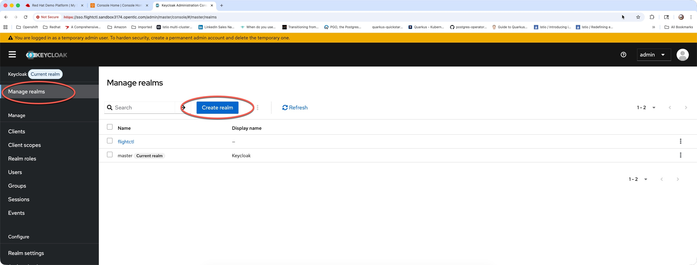
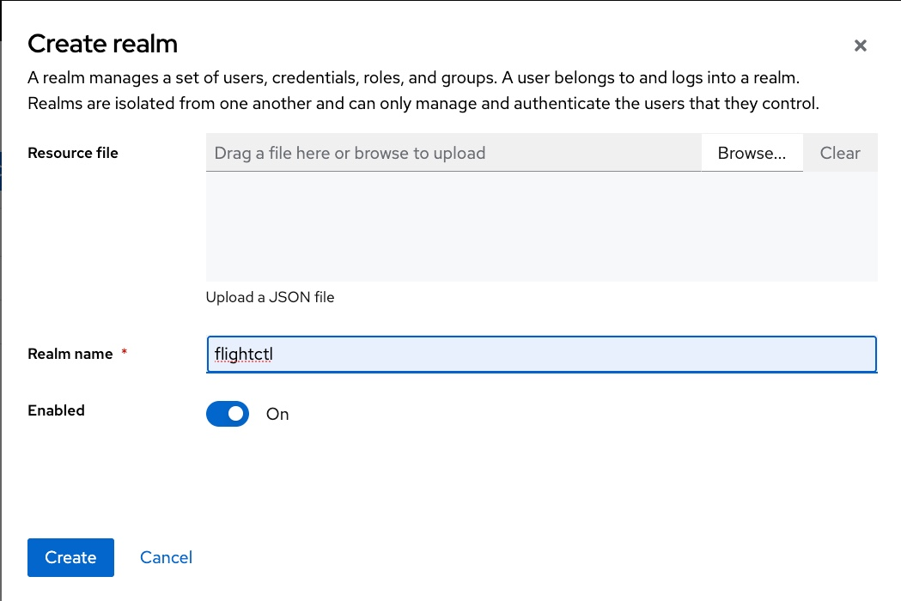
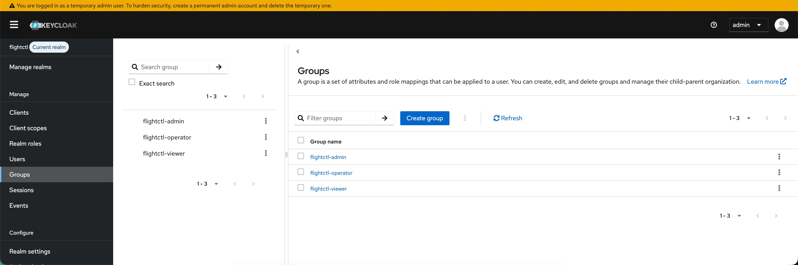
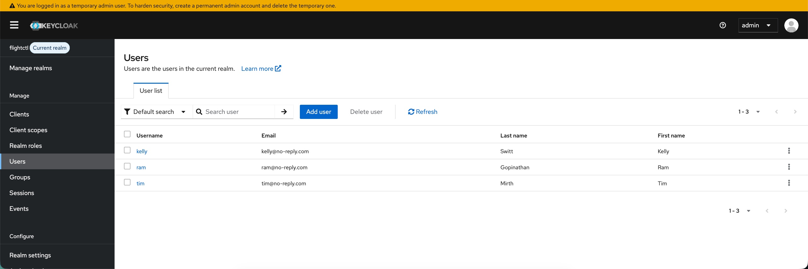
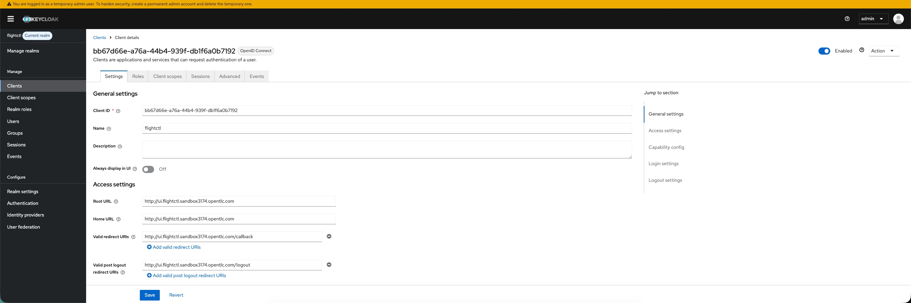
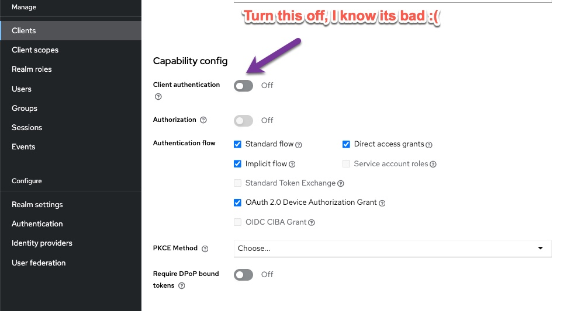
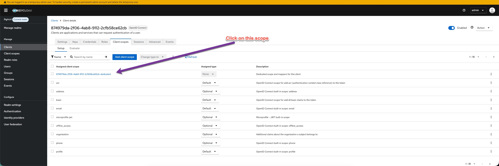
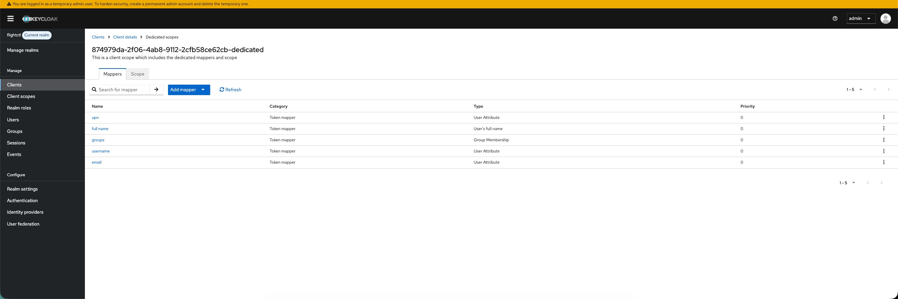
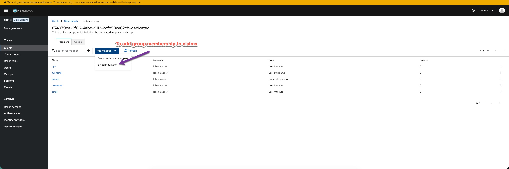
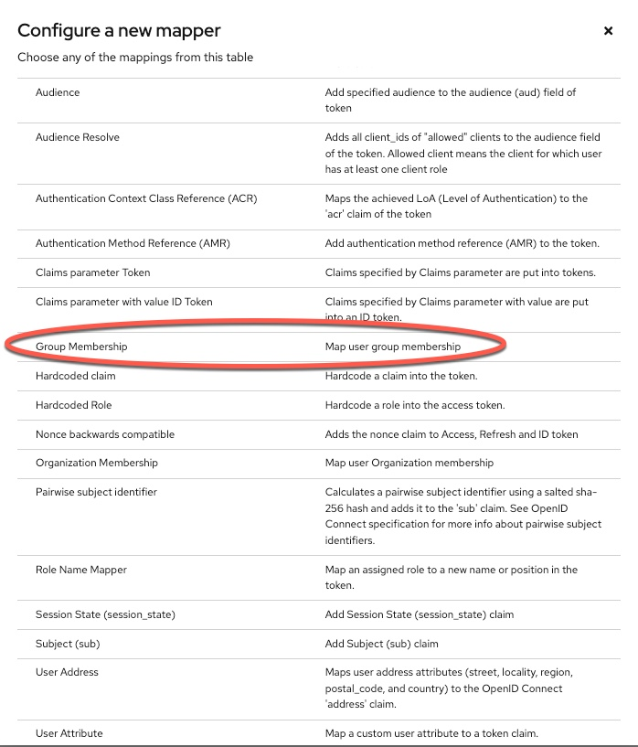

# edge-fleet-management
This repo contains all artifacts used in CloudNative PDX usergroup meeting

## Building microshift bootc image
Images are automatically built in github actions pipeline but

### Base image
First we will build a base bootc image with flightctl agent in it

```sh
make base REGISTRY=<specify> 
```

### Build Microshift bootc image
Build the fedora bootc microshift image with flightctl agent

```sh
make microshift REGISTRY=<specify>
```

### Overlay Cloud Init
Overlay microshift bootc image with cloudinit

```sh
make cloudinit REGISTRY=<specify>
```

### Build AMI
Build AMI to test in cloud. Before we can make AMI we need to setup the AWS account with vmimport service role. Run ansible playbook as shown below.

```sh
export VAULT_SECRET=<redacted>

ansible-playbook --vault-password-file <(echo "$VAULT_SECRET") configure_aws.yml
```

Run command below to make AMI

```sh
make ami REGISTRY=<specify>
```

### Create EKS Cluster to deploy flightctl
In this section we are going to provision an EKS cluster to run [flightctl](https://github.com/flightctl/flightctl). 

```sh
terraform init
terraform plan -out=tfplan
terraform apply tfplan
```

### Update kubeconfig
Run command below to update local kubeconfig file

```sh
aws eks update-kubeconfig --region us-west-2 --name edge-fleet-mgmt
```

### Install Keycloak
Install keycloak on EKS cluster as the authentication system for flightctl.

```sh
# First create a kubernetes namespace
kubectl create namespace keycloak

# Deploy Keycloak
kubectl apply -f keycloak.yaml -n keycloak
```

### Create Ingress for Keycloak
To access keycloak from web browser we need to create an ALB ingress. Run command below to create an ALB ingress

```sh
kubectl apply -f deploy/keycloak/ingress.yaml
```

### Create a Keycloak realm
Follow steps below to create a keycloak realm for `flightctl`

1. Navigate to keycloak web url from a browser and login with default credentials `admin:admin`

2. Select `Manage Realms` from left navigation bar and click on `Create realm` as shown in screen capture below



3. In the `Create realm` popup dialog specify `flightctl` for `Realm name` and click on `Create` to create the realm



### Create Groups and some Test Users
Next we will create some groups and test users for `flightctl`

#### Create Groups
Create 2 groups as shown below 

* flightctl-admin
* flightctl-operator
* flightctl-viewer

Its very important that the group names has to match exactly like above for RBAC in flightctl



#### Create Test Users
Create three test users and add them to respective groups as shown below



### Create a client app in keycloak for UI
Next we need to create a client app in keycloak for `flightctl-ui` application. Follow steps below to create and configure client application in keycloak

1. In keycloak admin console navigate to `Clients` from left navigation bar and click on `Create client` button to create a new client application

2. Fill in the client details, see an example in screen shot below 



3. Turn off `Client Authentication` under `Capability config` section. 



> Reason for this is that values file in Helmchart does not allow you to specify `ClientSecret` so after installing flightctl using helm chart and if you try to login it wouldn't work. Would like this to be enhanced to read client secret from a kubernetes secret.

4. Configure claims for flightctl ui application by selecting the `Client scopes` tab and click on dedicated scope and mappers for this client as shown in screen capture below



5. Add following claims shown in screen capture below. Pretty much all claims except groups can be added selecting option `From predefined mappers` under `Add mapper` drop down list.



6. Add group claim by selecting option `By configuration` under `Add mapper` drop down list



7. Select `Group Membership` from the `Configure a new mapper` popup screen as shown below



At this point we have successfully completed configuring a client application in keycloak for flightctl web application. We can now proceed to install flightctl with the helm chart.

### Install FlightCTL
This section will walk through how to install flightctl on EKS cluster using the [helm chart](https://github.com/flightctl/flightctl/tree/main/deploy/helm/flightctl) from the flightctl project repository. Before we run `helm install` below are changes that need to be made in default values file I used from the flightctl project repo.

Specify base domain and storage class under global section

```yaml
baseDomain: "flightctl.sandbox3174.opentlc.com"
storageClassName: "gp3"
```

Update Auth settings as shown in yaml snippet below

```yaml
auth:
    # -- Type of authentication to use. Allowed values: 'k8s', 'oidc', 'aap', 'openshift', 'oauth2', or 'none'.
    # When left empty (default and recommended), authentication type is auto-detected: 'openshift' on OpenShift clusters, 'k8s' otherwise.
    type: "oidc" # Auto-detect (openshift on OpenShift, k8s otherwise), or explicitly set: k8s, oidc, aap, openshift, oauth2, none
    # -- The custom CA cert.
    caCert: ""
    # -- True if verification of authority TLS cert should be skipped.
    insecureSkipTlsVerify: true
    k8s:
      # -- API URL of k8s cluster that will be used as authentication authority
      apiUrl: https://kubernetes.default.svc
      # -- In case flightctl is not running within a cluster, you can provide a name of a secret that holds the API token
      externalApiTokenSecretName: ""
      # -- Namespace that should be used for the RBAC checks
      rbacNs: ""
      # -- Create default flightctl-admin ServiceAccount with admin access
      createAdminUser: true
    oidc:
      # -- OIDC Client ID
      clientId: "bb67d66e-a76a-44b4-939f-db1f6a0b7192"
      # -- List of OIDC scopes to request (e.g. openid, profile, email, roles, offline_access)
      scopes:
      - "openid"
      - "profile"
      - "email"
      - "roles"
      - "offline_access"
      # -- The base URL for the OIDC provider that is reachable by flightctl services. Example: https://auth.foo.internal/realms/flightctl
      issuer: "https://sso.flightctl.sandbox3174.opentlc.com/realms/flightctl"
      # -- The base URL for the OIDC provider that is reachable by clients. Example: https://auth.foo.net/realms/flightctl
      externalOidcAuthority: "https://sso.flightctl.sandbox3174.opentlc.com/realms/flightctl"
      # -- Organization assignment configuration
      organizationAssignment:
        type: "static"
        organizationName: "default"
      # -- Username claim to extract from OIDC token (default: "preferred_username")
      usernameClaim:
        - "upn"
      # -- Role assignment configuration
      roleAssignment:
        type: "dynamic"
        claimPath:
          - "groups"
```

Set expose service method to "none" we will create the required ingress resource manually using ALB

```yaml
exposeServicesMethod: "none"
```

Lastly set `fsGroup` (This is not required if you are using external db such as AWS RDS) under `db->builtin` section

```yaml
# -- File system group ID for database pod security context
fsGroup: "26"
```

```sh
helm install edge-manager --namespace flightctl --create-namespace oci://quay.io/flightctl/charts/flightctl -f ./deploy/flightctl/values.yaml
```

Verify all pods are running by running command below

```sh
kubectl get pods -n flightctl
```

### Create Ingress resources
Create kubernetes ingress resources. You can find the ingress resource [yaml](./deploy/flightctl/ingress.yml) here. Please update according to fit to your environment, specifically certificate ARN, host etc. If you used the terraform scripts in this repo it should have created those in AWS already

```sh
kubectl apply -f ./deploy/flightctl/ingress.yml
```

Make sure ALB is successfully reconciled. You can check by running following commands on ingress resources

```sh
kubectl describe ing edgemanager-alb-ingress-api -n flightctl
kubectl describe ing edgemanager-alb-ingress-ui -n flightctl
```

### Login to flightctl service
Ensure that you can login to flightctl service using the web interface. Once logged in define a new repository and repository sync to sync fleet resources from git repo.


### Setup flightctl CLI
First we need to define another application in keycloak for flightctl CLI. Be sure to use localhost for all authentication redirects. Login to flightctl web UI and define a new authentication provider to allow login from CLI. Now you are ready to login to flightctl from cli

```sh
flightctl login https://api.flightctl.sandbox3174.opentlc.com --web --provider=flightctl-cli
```

Browser will open where you will be prompted to authenticate with keycloak and after successful login, CLI will be setup to interact with flightctl service

### Generate an Enrollment Certificate
Generate an enrollment certificate to be injected into the device for flightctl agent to enroll the device with flightctl service. Run command below to generate an enrollment certificate for devices

```sh
flightctl certificate request --signer=enrollment --expiration=365d --output=embedded > config.yaml
```

### Provision devices
In this section we will Provision our test devices, since this is a demo/test we are going to use EC2 instance and use the AMI we created earlier to demonstrate provisioning and enrollment into fleet. Playbook will generate cloud init user data file to dynamically inject the enrollment credentials as well as setups a local admin user to login to the devices. You can find the jinja [template](./playbooks/templates/user-data.j2) that is used to generate the cloud config file. 

Before you can provision test devices we need to setup ansible vault and include some secrets as shown in snippet below

```yaml
admin_user: <redacted>
admin_user_password: <redacted>
admin_user_ssh_pubkey: <redacted>
key_name: <redacted>
```

You can create the ansible vault by running command below. When promted enter a password for vault.

```sh
cd playbooks
ansible-vault create vars/secrets.yaml
```

Store the vault password in an environment variable as shown below

```sh
export VAULT_SECRET=<redacted>
```

Run command below to provision devices. Repo has 2 ansible vars file for test devices we want to provision but you are free to provision as many as you like by just increasing the `device_count` in vars file. Additionally be sure to update the AMI and subnet and security group details in the Ansible vars file

* [device-without-microshift](./playbooks/vars/device-without-microshift.yaml)
* [device-with-microshift](./playbooks/vars/device-with-microshift.yaml)

Provision the devices using the image that doesn't contain Microshift bits. Ideal for demonstrating running podman, legacy VM, RPM apps etc.

```sh
ansible-playbook --vault-password-file <(echo "$VAULT_SECRET") launch_instance.yaml -e @vars/device-without-microshift.yaml
```

Provision the second device, Image for this device include Microshift cluster and is ideal for demonstrating openshift/k8s application running on edge devices. 

```sh
ansible-playbook --vault-password-file <(echo "$VAULT_SECRET") launch_instance.yaml -e @vars/device-with-microshift.yaml
```

### Agent API Configurations
TODO:
